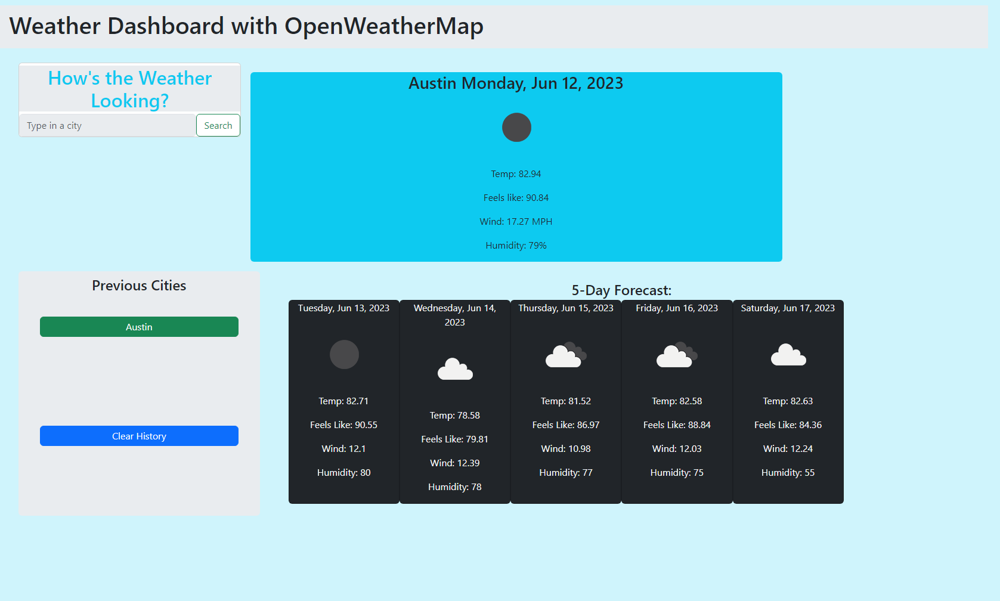

# *module-6-challenge* (Weather Dashboard)

## **Description**

The intention of this challenge was to create an app that offered the user weather information on a city when typed into the search bar. The app would include the current weather in the city and a 5-day forecast while saving your entry to the side of the screen.

This project is a demonstration of a weather dashboard made with javascript with the help of a server-side API. The project utilizes Bootstrap for the css elements within the html, JQuery to link API functionality to OpenWeatherAPI along with elements that allowed me to add and remove certain classes, dayjs for current date and time, and localstorage for storing key value pairs when typing a city into the search bar. 

## **Installation**

https://jakelipscomb.github.io/weather-dashboard/





## **Technologies**
Project is created with:
* Visual Studio Code version: 1.78.2
* Bootstrap CSS 5.3.0
* JQuery 3.7.0
* Day.js
* OpenWeatherAPI
	
## **Setup**
To run this project, clone it locally using bash:

```
$ bash
$ git clone https://github.com/jakelipscomb/weather-dashboard.git
```

## **Credits**
Coursework provided by The University of Texas at Austin Center for Professional Education Coding Boot Camp

https://www.edx.org/course/the-coding-boot-camp-at-ut-austin#24775ad0-27b4-53da-943a-30a2a394c452

## **License**

MIT License

Copyright (c) 2023 jakelipscomb

Permission is hereby granted, free of charge, to any person obtaining a copy
of this software and associated documentation files (the "Software"), to deal
in the Software without restriction, including without limitation the rights
to use, copy, modify, merge, publish, distribute, sublicense, and/or sell
copies of the Software, and to permit persons to whom the Software is
furnished to do so, subject to the following conditions:

The above copyright notice and this permission notice shall be included in all
copies or substantial portions of the Software.

THE SOFTWARE IS PROVIDED "AS IS", WITHOUT WARRANTY OF ANY KIND, EXPRESS OR
IMPLIED, INCLUDING BUT NOT LIMITED TO THE WARRANTIES OF MERCHANTABILITY,
FITNESS FOR A PARTICULAR PURPOSE AND NONINFRINGEMENT. IN NO EVENT SHALL THE
AUTHORS OR COPYRIGHT HOLDERS BE LIABLE FOR ANY CLAIM, DAMAGES OR OTHER
LIABILITY, WHETHER IN AN ACTION OF CONTRACT, TORT OR OTHERWISE, ARISING FROM,
OUT OF OR IN CONNECTION WITH THE SOFTWARE OR THE USE OR OTHER DEALINGS IN THE
SOFTWARE.

---